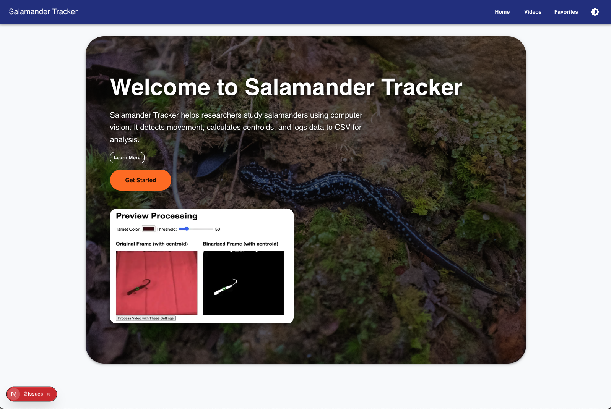
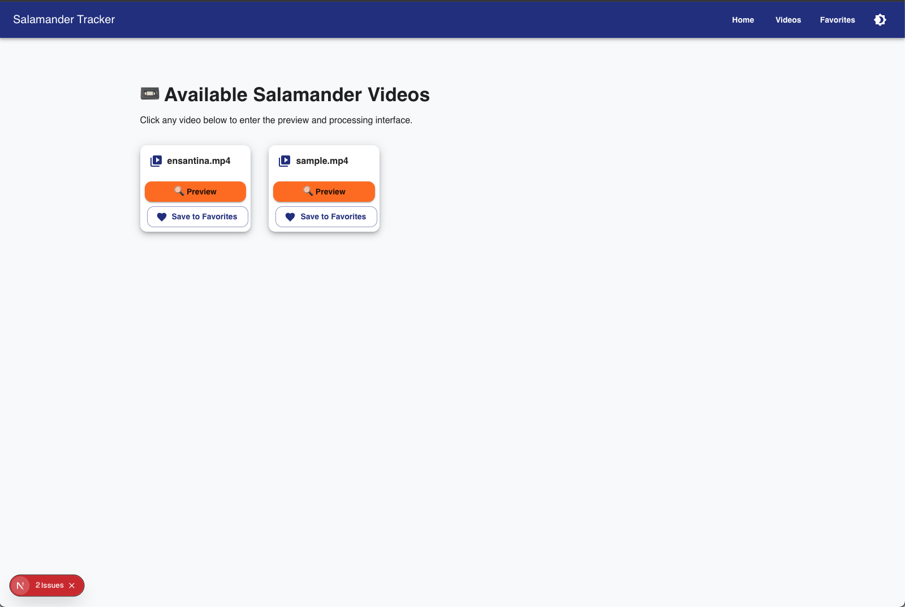
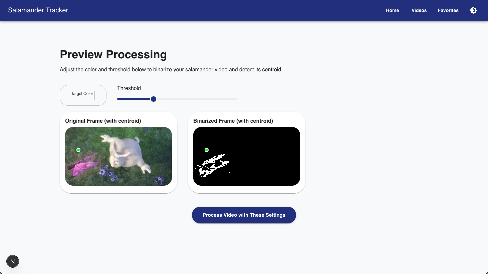

# 🦎 Salamander Tracker Full-Stack Project

This repository contains both the **frontend (Next.js + React)** and the **backend (Node.js + Express + Java)** components of the Salamander Tracker application, a full-stack app that allows users to upload, preview, and process videos to detect salamanders based on color thresholding and centroid detection.

---

## 📦 Backend: Centroid Finder

# 🎥 Centroid Finder (Backend)

This is the backend service for Salamander Tracker. It is a Dockerized Node.js + Express server that wraps around a Java JAR video processor to analyze MP4 files and extract centroid position data.

## 🔧 Features

- 🧠 Accepts color + threshold params to track centroids
- 🛠️ Processes MP4 video frames using Java JAR
- 📤 Exposes REST API endpoints for frontend integration
- 📂 Returns CSV output of centroids over time

## 🧱 Technologies Used

- Node.js + Express
- Java (via Maven JAR)
- `child_process` for executing JARs
- `uuid` for job management
- Docker

## 📁 Project Structure

```bash
centroid-finder/
├── processor/          # Java Maven video processor
│   └── src/main/java/...
├── server/             # Express backend
│   ├── routes/
│   ├── controllers/
│   ├── utils/
│   └── server.js
├── Dockerfile
├── docker-compose.yml
└── README.md
```

## 📦 Running the Server

```bash
# Navigate to server directory
cd server

# Install dependencies
npm install

# Add .env file
cp .env.example .env

# Start the backend
npm run dev
```

## 🧪 API Endpoints

| Method | Endpoint | Description |
|--------|----------|-------------|
| GET    | `/api/videos` | List video filenames |
| GET    | `/api/videos/thumbnail/:filename` | Return thumbnail from video |
| POST   | `/api/process/:filename` | Start centroid processing job |
| GET    | `/api/process/:jobId/status` | Get job status |
| GET    | `/api/process/:jobId/result` | Download CSV result |

## 🐳 Docker Usage

```bash
# Build the Docker image
docker build -t centroid-finder .

# Run the container
docker run -p 3001:3001 centroid-finder
```

> Ensure your Java JAR file is located at `/processor/target/centroid-processor.jar`

---

## 💻 Frontend: Salamander Tracker

# 🦎 Salamander Tracker (Frontend)

Salamander Tracker is the frontend React + Next.js application that enables users to preview, process, and visualize centroid tracking on videos using color-based thresholds.

## 🚀 Features

- 📼 Upload and preview salamander videos
- 🎯 Adjust target color and threshold for binarization
- 📊 Submit processing jobs to backend and view CSV results
- ❤️ Save videos to favorites (local context-based state)
- 🧪 Includes simple tests with Jest and React Testing Library

## 🧱 Technologies Used

- [Next.js](https://nextjs.org/)
- [React](https://reactjs.org/)
- [Material UI](https://mui.com/)
- [Jest](https://jestjs.io/) + [React Testing Library](https://testing-library.com/)
- [Tailwind CSS](https://tailwindcss.com/)

## 🧪 Running Locally

```bash
# Clone the repository
git clone https://github.com/alstondsouza1/salamander-tracker.git
cd salamander-tracker

# Install dependencies
npm install

# Start the dev server
npm run dev

# App will be running on http://localhost:3000
```

## 🧪 Run Tests

```bash
npm test
```

## 🔗 Backend API Requirements

This frontend expects a running backend API at `http://localhost:3001` (or as defined in `.env.local`) with the following endpoints:

- `GET /api/videos` – list available videos
- `GET /api/videos/thumbnail/:filename` – get thumbnail preview
- `POST /api/process/:filename` – start processing job
- `GET /api/process/:jobId/status` – check processing status
- `GET /api/process/:jobId/result` – get CSV results

## 🐳 Dockerized Usage

If backend is Dockerized, ensure ports and volumes are exposed to support cross-origin requests.

---

## 📸 Screenshots

### 🎬 Home Page Preview


### 🎬 Video Selection Page


### 🔍 Preview & Centroid Detection


---

## 🛠 Architecture Diagram

The system is divided into three parts:

```
Frontend (Next.js + React)
        |
        | REST API
        ↓
Backend (Node.js + Express)
        |
        | Executes via child_process
        ↓
Video Processor (Java JAR)
```

---

## 🚀 Deployment

### Using Docker (Recommended)

1. **Build and start the backend Docker container**:
    ```bash
    cd centroid-finder
    docker build -t centroid-backend .
    docker run -p 3001:3001 -v $(pwd)/videos:/app/videos -v $(pwd)/results:/app/results centroid-backend
    ```

2. **Start the frontend (from another terminal)**:
    ```bash
    cd salamander-tracker
    npm install
    npm run dev
    ```

3. Visit the app at `http://localhost:3000`.

---

## 🧪 Testing

### Frontend

```bash
cd salamander-tracker
npm install
npm test
```

### Backend

The backend is tested by running API endpoints manually using Postman or CURL after launching the Express server.

---

## 🧑‍💻 Maintainers

- [@alstondsouza1](https://github.com/alstondsouza1)
- [@RMarx1456](https://github.com/RMarx1456)

---
